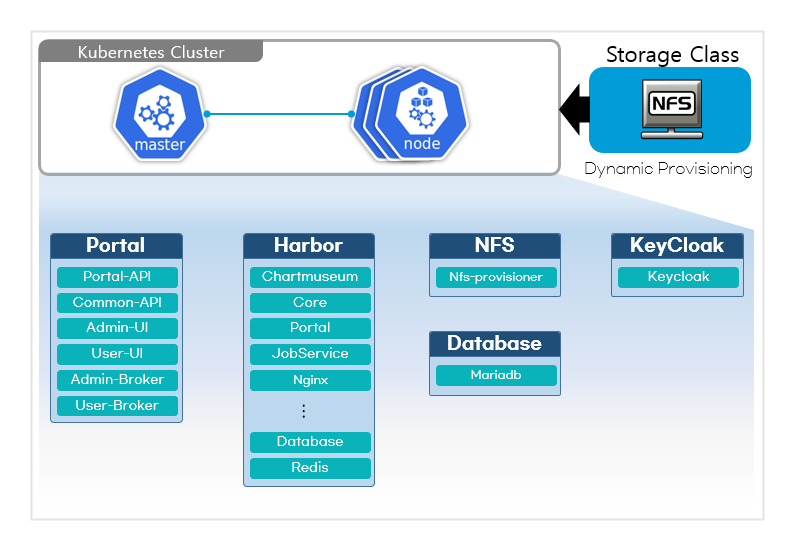

### [Index](https://github.com/K-PaaS/cp-guide-eng) > [CP Install](/install-guide/README.md) > Deployment as a Service Portal Installation Guide

<br>

## Table of Contents

1. [Document Overview](#1)<br>
     1.1. [Purpose](#1.1)<br>
     1.2. [Range](#1.2)<br>
     1.3. [System configuration diagram](#1.3)<br>
     1.4. [Reference Material](#1.4)<br>

2. [Prerequisite](#2)<br>
     2.1. [Firewall Information](#2.1)<br>

3. [Container Platform Portal Deployment](#3)<br>
     3.1. [Container Platform Portal Deployment](#3.1)<br>
     3.1.1. [Container Platform Portal Deployment File Download](#3.1.1)<br>
     3.1.2. [Container platform portal variable definition](#3.1.2)<br>
     3.1.3. [Run container platform portal deployment script](#3.1.3)<br>
     3.1.4. [(Reference) Delete Container Platform Portal Resource](#3.1.4)<br>

4. [Configuring Container Platform Portal User Authentication Service](#4)<br>
     4.1. [Download Container Platform Portal User Authentication Configuration Deployment](#4.1)<br>
     4.2. [Define Container Platform Portal User Authentication Configuration Variables](#4.2)<br>
     4.3. [Run Container Platform Portal User Authentication Configuration Script](#4.3)<br>
     4.4. [(Reference) Unconfigure Container Platform Portal User Authentication](#4.4)<br>

5. [Container Platform Portal Service Broker](#5)<br>
     5.1. [Container platform portal service broker registration](#5.1)<br>
     5.2. [Container platform portal service inquiry settings](#5.2)<br>
     5.3. [Container Platform Portal User Guide](#5.3)<br>

6. [Refer to Container Platform Portal](#6)<br>
     6.1. [Precautions when creating Kubernetes resources](#6.1)<br>


## <div id='1'>1. Document Overview
### <div id='1.1'>1.1. purpose
This document (Container Platform Service Deployment Portal Installation Guide) describes how to install Kubernetes Cluster and deploy the Container Platform Service Deployment Portal.<br>
<br>

### <div id='1.2'>1.2. range
The installation scope was created based on Kubernetes Cluster deployment.

<br>

### <div id='1.3'>1.3. System configuration diagram
<p align="center"></p>

The system configuration consists of a **Kubernetes Cluster (Master, Worker)** environment and a storage server for data management.
**Harbor** manages the container platform portal image and Helm Chart in the Kubernetes Cluster environment installed through Kubespray, **Keycloak** manages container platform portal user authentication, **Vault** manages authentication data, and Meta A middleware environment such as **MariaDB (RDBMS)** that manages data is provided as a container.
The total required VM environment requires **Master VM: 1, Worker VM: 3 or more**, and this document is about deploying a container platform portal environment in a Kubernetes Cluster.

<br>

### <div id='1.4'>1.4. reference material
> https://kubernetes.io/ko/docs<br>
> https://goharbor.io/docs<br>
> https://www.keycloak.org/documentation

<br>

## <div id='2'>2. Prerequisite
This installation guide was written based on installation in the **Ubuntu 20.04** environment.

### <div id='2.1'>2.1. firewall information
Set the port to be opened in the IaaS Security Group.

- Master Node

| <center>Protocol</center> | <center>Port</center> | <center>Remarks</center> |
| :---: | :---: | :--- |
| TCP | 111 | NFS PortMapper |
| TCP | 2049 | NFS |
| TCP | 2379-2380 | etcd server client API |
| TCP | 6443 | Kubernetes API Server |
| TCP | 10250 | Kubelet API |
| TCP | 10251 | kube-scheduler |
| TCP | 10252 | kube-controller-manager |
| TCP | 10255 | Read-Only Kubelet API |
| UDP | 4789 | Calico networking VXLAN |

- Worker Nodes

| <center>Protocol</center> | <center>Port</center> | <center>Remarks</center> |
| :---: | :---: | :--- |
| TCP | 111 | NFS PortMapper |
| TCP | 2049 | NFS |
| TCP | 10250 | Kubelet API |
| TCP | 10255 | Read-Only Kubelet API |
| TCP | 30000-32767 | NodePort Services |
| UDP | 4789 | Calico networking VXLAN |

<br>

## <div id='3'>3. Deploying the Container Platform Portal

### <div id='3.1'>3.1. Deploying the Container Platform Portal

#### <div id='3.1.1'>3.1.1. Container Platform Portal Download Deployment File
To deploy the container platform portal, download the container platform portal deployment file and place it in the path below.<br>
:bulb: This content is carried out in Kubernetes **Master Node**.

+ Download Container Platform Portal Deployment file:
    [cp-portal-deployment-v1.4.0.tar.gz](https://nextcloud.k-paas.org/index.php/s/WtNQn2agk6epFHC/download)

```
# Create deployment file download path
$ mkdir -p ~/workspace/container-platform
$ cd ~/workspace/container-platform

# Download Deployment file and check file path
$ wget --content-disposition https://nextcloud.k-paas.org/index.php/s/WtNQn2agk6epFHC/download

$ ls ~/workspace/container-platform
   cp-portal-deployment-v1.4.0.tar.gz

# Unzip the Deployment file
$ tar -xvf cp-portal-deployment-v1.4.0.tar.gz
```

- Deployment file directory configuration
```
├── script # Location of variables and script files related to container platform portal deployment
├── images # Container Platform Portal image file location
├── charts # Container Platform Portal Helm Charts file location
├── values_orig # Container Platform Portal Helm Charts values.yaml file location
└── keycloak_orig # Keycloak deployment-related file location for container platform portal user authentication management
```
<br>

#### <div id='3.1.2'>3.1.2. Container Platform Portal Variable Definitions
Before deploying the container platform portal, variable values need to be defined. Confirm the information required for distribution and set variables.

:bulb: Keycloak's default distribution method is **HTTP**, and if you want to set up **HTTPS** through a certificate, refer to the guide below to preprocess.
> [Keycloak TLS Settings](cp-portal-deployment-keycloak-tls-setting-guide.md#2-keycloak-tls-settings)

<br>

```
$ cd ~/workspace/container-platform/cp-portal-deployment/script
$ vi cp-portal-vars.sh
```

```
# COMMON VARIABLE (Please change the values of the four variables below.)
K8S_MASTER_NODE_IP="{k8s master node public ip}" # Kubernetes Master Node Public IP
HOST_CLUSTER_IAAS_TYPE="{host cluster iaas type}" # Host Cluster IaaS Type (Please enter 'AWS' or 'OPENSTACK')
PROVIDER_TYPE="{container platform portal provider type}" # Container Platform Portal Provider Type (Please enter 'standalone' or 'service')
....
```
```
#Example
K8S_MASTER_NODE_IP="xx.xxx.xxx.xx"
HOST_CLUSTER_IAAS_TYPE="AWS"
PROVIDER_TYPE="service"
```

- **K8S_MASTER_NODE_IP** <br>Enter Kubernetes Master Node Public IP<br><br>
- **HOST_CLUSTER_IAAS_TYPE** <br>Enter Kubernetes Cluster IaaS environment <br><br>
- **PROVIDER_TYPE** <br>Enter container platform portal provision type <br>
    + This guide is a portal service distribution type installation guide and requires entering the **'service'** value.

<br>


#### <div id='3.1.3'>3.1.3. Run the Container Platform Portal deployment script
Run the deployment script to deploy the container platform portal.

```
$ chmod +x deploy-cp-portal.sh
$ ./deploy-cp-portal.sh
```
<br>

Check whether the container platform portal related resources are deployed properly.<br>
In the case of resource Pods, it takes several seconds to transition to Running state after binding to Node and creating a container.


- **Harbor resource inquiry**
>`$ kubectl get all -n harbor`      
```
$ kubectl get all -n harbor
NAME                                           READY   STATUS    RESTARTS        AGE
pod/cp-harbor-chartmuseum-6fdd486868-266t9     1/1     Running   0               3m14s
pod/cp-harbor-core-794489c7b4-hbtmb            1/1     Running   0               3m14s
pod/cp-harbor-database-0                       1/1     Running   0               3m14s
pod/cp-harbor-jobservice-5fdbf6cb6b-vjxxd      1/1     Running   3 (2m27s ago)   3m14s
pod/cp-harbor-nginx-6db895bdbb-dp7zk           1/1     Running   0               3m14s
pod/cp-harbor-notary-server-57676cff76-7f292   1/1     Running   0               3m14s
pod/cp-harbor-notary-signer-64cc867bbb-hwvxp   1/1     Running   0               3m14s
pod/cp-harbor-portal-7f9d57dcf4-5f68g          1/1     Running   0               3m14s
pod/cp-harbor-redis-0                          1/1     Running   0               3m14s
pod/cp-harbor-registry-5fdf76f6cf-jhsxl        2/2     Running   0               3m14s
pod/cp-harbor-trivy-0                          1/1     Running   0               3m14s

NAME                              TYPE        CLUSTER-IP      EXTERNAL-IP   PORT(S)                       AGE
service/cp-harbor-chartmuseum     ClusterIP   10.233.10.224   <none>        80/TCP                        3m15s
service/cp-harbor-core            ClusterIP   10.233.7.180    <none>        80/TCP                        3m15s
service/cp-harbor-database        ClusterIP   10.233.55.195   <none>        5432/TCP                      3m15s
service/cp-harbor-jobservice      ClusterIP   10.233.19.242   <none>        80/TCP                        3m15s
service/cp-harbor-notary-server   ClusterIP   10.233.55.160   <none>        4443/TCP                      3m15s
service/cp-harbor-notary-signer   ClusterIP   10.233.15.151   <none>        7899/TCP                      3m15s
service/cp-harbor-portal          ClusterIP   10.233.30.190   <none>        80/TCP                        3m15s
service/cp-harbor-redis           ClusterIP   10.233.29.164   <none>        6379/TCP                      3m15s
service/cp-harbor-registry        ClusterIP   10.233.49.111   <none>        5000/TCP,8080/TCP             3m15s
service/cp-harbor-trivy           ClusterIP   10.233.48.64    <none>        8080/TCP                      3m15s
service/harbor                    NodePort    10.233.46.29    <none>        80:30002/TCP,4443:30004/TCP   3m15s

NAME                                      READY   UP-TO-DATE   AVAILABLE   AGE
deployment.apps/cp-harbor-chartmuseum     1/1     1            1           3m15s
deployment.apps/cp-harbor-core            1/1     1            1           3m15s
deployment.apps/cp-harbor-jobservice      1/1     1            1           3m15s
deployment.apps/cp-harbor-nginx           1/1     1            1           3m15s
deployment.apps/cp-harbor-notary-server   1/1     1            1           3m15s
deployment.apps/cp-harbor-notary-signer   1/1     1            1           3m15s
deployment.apps/cp-harbor-portal          1/1     1            1           3m15s
deployment.apps/cp-harbor-registry        1/1     1            1           3m15s

NAME                                                 DESIRED   CURRENT   READY   AGE
replicaset.apps/cp-harbor-chartmuseum-6fdd486868     1         1         1       3m15s
replicaset.apps/cp-harbor-core-794489c7b4            1         1         1       3m15s
replicaset.apps/cp-harbor-jobservice-5fdbf6cb6b      1         1         1       3m15s
replicaset.apps/cp-harbor-nginx-6db895bdbb           1         1         1       3m15s
replicaset.apps/cp-harbor-notary-server-57676cff76   1         1         1       3m15s
replicaset.apps/cp-harbor-notary-signer-64cc867bbb   1         1         1       3m15s
replicaset.apps/cp-harbor-portal-7f9d57dcf4          1         1         1       3m15s
replicaset.apps/cp-harbor-registry-5fdf76f6cf        1         1         1       3m15s

NAME                                  READY   AGE
statefulset.apps/cp-harbor-database   1/1     3m15s
statefulset.apps/cp-harbor-redis      1/1     3m15s
statefulset.apps/cp-harbor-trivy      1/1     3m15s
```  
- **MariaDB resource query**
>`$ kubectl get all -n mariadb`
```
$ kubectl get all -n mariadb
NAME               READY   STATUS    RESTARTS   AGE
pod/cp-mariadb-0   1/1     Running   0          96s

NAME                 TYPE       CLUSTER-IP      EXTERNAL-IP   PORT(S)          AGE
service/cp-mariadb   NodePort   10.233.19.252   <none>        3306:31306/TCP   97s

NAME                          READY   AGE
statefulset.apps/cp-mariadb   1/1     97s
```    

- **Keycloak resource query**
>`$ kubectl get all -n keycloak`     
```
$ kubectl get all -n keycloak
NAME                               READY   STATUS    RESTARTS      AGE
pod/cp-keycloak-7d49f84bc6-qdljr   1/1     Running   1 (55s ago)   119s
pod/cp-keycloak-7d49f84bc6-xbg92   1/1     Running   0             119s

NAME                          TYPE        CLUSTER-IP      EXTERNAL-IP   PORT(S)          AGE
service/cp-keycloak           NodePort    10.233.41.247   <none>        8080:32710/TCP   119s
service/cp-keycloak-cluster   ClusterIP   None            <none>        8080/TCP         119s

NAME                          READY   UP-TO-DATE   AVAILABLE   AGE
deployment.apps/cp-keycloak   2/2     2            2           119s

NAME                                     DESIRED   CURRENT   READY   AGE
replicaset.apps/cp-keycloak-7d49f84bc6   2         2         2       119s
```

- **Container Platform portal resource query**
>`$ kubectl get all -n cp-portal`        
```
$ kubectl get all -n cp-portal
NAME                                                      READY   STATUS    RESTARTS   AGE
pod/cp-portal-api-deployment-595dd4dfb6-smt9v             1/1     Running   0          69s
pod/cp-portal-common-api-deployment-c54d88fbc-fq27x       1/1     Running   0          66s
pod/cp-portal-metric-api-deployment-6599f47b4b-p8sm4      1/1     Running   0          61s
pod/cp-portal-service-broker-deployment-59b99677b-grnkw   1/1     Running   0          52s
pod/cp-portal-terraman-deployment-5ccfbf67fc-2tdcq        1/1     Running   0          59s
pod/cp-portal-ui-deployment-669db699c-8lmlr               1/1     Running   0          74s

NAME                                       TYPE       CLUSTER-IP      EXTERNAL-IP   PORT(S)          AGE
service/cp-portal-api-service              NodePort   10.233.32.224   <none>        3333:32701/TCP   69s
service/cp-portal-common-api-service       NodePort   10.233.49.204   <none>        3334:32700/TCP   66s
service/cp-portal-metric-api-service       NodePort   10.233.19.109   <none>        8900:30329/TCP   61s
service/cp-portal-service-broker-service   NodePort   10.233.11.159   <none>        3330:32704/TCP   52s
service/cp-portal-terraman-service         NodePort   10.233.12.100   <none>        8091:32707/TCP   59s
service/cp-portal-ui-service               NodePort   10.233.54.138   <none>        8090:32703/TCP   74s

NAME                                                  READY   UP-TO-DATE   AVAILABLE   AGE
deployment.apps/cp-portal-api-deployment              1/1     1            1           69s
deployment.apps/cp-portal-common-api-deployment       1/1     1            1           66s
deployment.apps/cp-portal-metric-api-deployment       1/1     1            1           61s
deployment.apps/cp-portal-service-broker-deployment   1/1     1            1           52s
deployment.apps/cp-portal-terraman-deployment         1/1     1            1           59s
deployment.apps/cp-portal-ui-deployment               1/1     1            1           74s

NAME                                                            DESIRED   CURRENT   READY   AGE
replicaset.apps/cp-portal-api-deployment-595dd4dfb6             1         1         1       69s
replicaset.apps/cp-portal-common-api-deployment-c54d88fbc       1         1         1       66s
replicaset.apps/cp-portal-metric-api-deployment-6599f47b4b      1         1         1       61s
replicaset.apps/cp-portal-service-broker-deployment-59b99677b   1         1         1       52s
replicaset.apps/cp-portal-terraman-deployment-5ccfbf67fc        1         1         1       59s
replicaset.apps/cp-portal-ui-deployment-669db699c               1         1         1       74s
```    

<br>

#### <div id='3.1.4'>3.1.4. (Reference) Deleting Container Platform Portal Resources
If you want to delete the deployed container platform portal resource, run the script below.<br>
:loudspeaker: (Caution) When running this script while the container platform portal is running, caution is required because **all resources required for operation will be deleted**.<br>

```
$ cd ~/workspace/container-platform/cp-portal-deployment/script
$ chmod +x uninstall-cp-portal.sh
$ ./uninstall-cp-portal.sh
```
```    
Are you sure you want to delete the container platform portal? <y/n> y
.... 
    
release "cp-harbor" uninstalled
namespace "harbor" deleted
release "cp-mariadb" uninstalled
namespace "mariadb" deleted
release "cp-keycloak" uninstalled
namespace "keycloak" deleted
release "cp-portal-api" uninstalled
release "cp-portal-common-api" uninstalled
release "cp-portal-configmap" uninstalled
release "cp-portal-metric-api" uninstalled
release "cp-portal-service-broker" uninstalled
release "cp-portal-terraman" uninstalled
release "cp-portal-ui" uninstalled
namespace "cp-portal" deleted
"cp-portal-repository" has been removed from your repositories
Uninstalled plugin: cm-push

....    
```
<br>
  

## <div id='4'>4. Configuring the Container Platform Portal User Authentication Service
Container platform portal user authentication is managed through the Keycloak service. To access the container platform portal using the user account of K-PaaS portal's user authentication service UAA.
Steps are required to configure the UAA service as an Identity Provider and the Keycloak service as a Service Provider.

#### <div id='4.1'>4.1. Configuring Container Platform Portal User Authentication Download Deployment
Download the deployment file for configuring UAA service and Keycloak service authentication and place it in the path below.<br>
:bulb: This content is carried out in **BOSH Inception** where the K-PaaS portal is installed.

+ Container Platform Portal User Authentication Configuration Deployment Download:
    [cp-saml-deployment-v1.4.0.tar.gz](https://nextcloud.paas-ta.org/index.php/s/MajerbG3ZHQZQJ8/download)

```
# Create deployment file download path
$ mkdir -p ~/workspace/container-platform
$ cd ~/workspace/container-platform

# Download Deployment file and check file path
$ wget --content-disposition https://nextcloud.paas-ta.org/index.php/s/MajerbG3ZHQZQJ8/download

$ ls ~/workspace/container-platform
   cp-saml-deployment-v1.4.0.tar.gz

# Unzip the Deployment file
$ tar -xvf cp-saml-deployment-v1.4.0.tar.gz
```
<br>

#### <div id='4.2'>4.2. Define Container Platform Portal user authentication configuration variables
It is necessary to define variable values to configure UAA service and Keycloak service authentication. Confirm the information required for configuration and set variables.

:bulb: If the **Keycloak TLS HTTPS** setting is applied, the Keycloak URL variable value needs to be changed. <br>
Change variable values by referring to the guide below.
> [(Deployment-as-a-Service) Change User Authentication Service Configuration](cp-portal-deployment-keycloak-tls-setting-guide.md#3-As-Service-Deployment-User-Authentication-Service-Configuration-Change)

<br>

```
$ cd ~/workspace/container-platform/cp-saml-deployment
$ vi cp-saml-vars.sh
```

```
# COMMON VARIABLE
PAASTA_SYSTEM_DOMAIN="xx.xxx.xx.xxx.nip.io" # PaaS-TA System Domain
K8S_MASTER_NODE_IP="xx.xxx.xx.xxx" # Kubernetes Master Node Public IP
UAA_CLIENT_ADMIN_ID="admin" # UAA Admin Client ID (e.g. admin)
UAA_CLIENT_ADMIN_SECRET="admin-secret" # UAA Admin Client Secret (e.g. admin-secret)
....
```


- **PAASTA_SYSTEM_DOMAIN** <br> Enter the System Domain name specified when deploying PaaS-TA<br><br>
- **K8S_MASTER_NODE_IP** <br>Enter Kubernetes Master Node Public IP<br><br>
- **UAA_CLIENT_ADMIN_ID** <br>Enter UAAC Admin Client Admin ID (default value: admin)<br><br>
- **UAA_CLIENT_ADMIN_SECRET** <br>Secret variable for accessing UAAC Admin Client (default value: admin-secret)<br><br>

<br>

#### <div id='4.3'>4.3. Run the Container Platform Portal User Authentication Configuration Script
Run the script to configure UAA service and Keycloak service authentication.

```
$ chmod +x create-service-provider.sh
$ ./create-service-provider.sh
```

<br>

Check whether the configuration was processed properly. (**CHECK MY RESULTS IN RESPONSE BODY**)
- UAAC Service Providers Search
>`$ uaac curl /saml/service-providers --insecure`
```
$ uaac curl /saml/service-providers --insecure
GET https://uaa.xx.xxx.xxx.xx.nip.io/saml/service-providers

200 OK
RESPONSE HEADERS:
   Cache-Control: no-cache, no-store, max-age=0, must-revalidate
   Content-Type: application/json
....
RESPONSE BODY:
[
   {
     "config": "{\"metaDataLocation\": .... }",
     "id": "c86dd09a-2d47-4005-943d-a4fc717efd0e",
     "entityId": "http://xx.xxx.xxx.xx:32710/auth/realms/cp-realm",
     "name": "cp-saml-sp",
     "version": 0,
     "created": 1651815898042,
     "lastModified": 1651815898042,
     "active": true,
     "identityZoneId": "uaa"
   }
]
```

<br>

#### <div id='4.4'>4.4. (Reference) Unconfigure Container Platform Portal User Authentication
If you want to unconfigure UAA service and Keycloak service authentication, run the script below.<br>
:loudspeaker: (Caution) When running this script while the container platform portal is running, caution is required as user authentication cannot be configured.<br>


##### Lookup Service Provider ID to be released
After searching UAAC Service Providers, search **Service Provider ID** with the conditions below in the **RESPONSE BODY** results.
- `entityId: http://{K8S_MASTER_NODE_IP}:32710/auth/realms/cp-realm` <br>
- `name: cp-saml-sp` 

<br>

```  
$ uaac curl /saml/service-providers --insecure

....
RESPONSE BODY:
[
  {
    "config": "{\"metaDataLocation\": .... }",
    "id": "c86dd09a-2d47-4005-943d-a4fc717efd0e",   # 해제할 Service Provider ID
    "entityId": "http://xx.xxx.xxx.xx:32710/auth/realms/cp-realm",
    "name": "cp-saml-sp",
    "version": 0,
    "created": 1651815898042,
    "lastModified": 1651815898042,
    "active": true,
    "identityZoneId": "uaa"
  }
....    
]
```    
<br>

After looking up the **Service Provider ID** to be released, run the authentication deconfiguration script.

```
$ cd ~/workspace/container-platform/cp-saml-deployment
$ chmod +x uninstall-service-provider.sh
$ ./uninstall-service-provider.sh {Service_Provider_ID}
```

```
$ ./uninstall-service-provider.sh c86dd09a-2d47-4005-943d-a4fc717efd0e
....
Are you sure you want to delete this service provider? <y/n>y
DELETE https://uaa.xx.xxx.xxx.xx.nip.io/saml/service-providers/c86dd09a-2d47-4005-943d-a4fc717efd0e
....
```

<br>

## <div id='5'>5. Container Platform Portal Service Broker
When installing the container platform K-PaaS service-type portal, a broker must be registered to link the container platform portal service deployed on CF and Kubernetes.
If you register and disclose a service through the K-PaaS operator portal, you can apply and use the service through the K-PaaS user portal.

### <div id='5.1'>5.1. Container Platform Portal Service Broker Registration
When registering a service broker, you must be logged in as a user who can register a service broker on the open cloud platform.

##### Check the list of service brokers.
>`$ cf service-brokers`
```
$ cf service-brokers
Getting service brokers as admin...
No service brokers found
```


##### Register the container platform portal service broker.
>`$ cf create-service-broker {service pack name} {service pack user ID} {service pack user password} http://{service pack URL}`

Service pack name: Name displayed on the open cloud platform for service pack management<br>
Service pack user ID/password: User ID/password to access the service pack<br>
Service pack URL: URL where you can use the API provided by the service pack<br>


###### Register Container Platform Portal Service Broker
>`$ cf create-service-broker cp-portal-service-broker admin cloudfoundry http://{K8S_MASTER_NODE_IP}:32704`

```
$ cf create-service-broker cp-portal-service-broker admin cloudfoundry http://xx.xxx.xxx.xx:32704
Creating service broker cp-portal-service-broker as admin...
OK
```

##### Check the registered container platform portal service broker.
>`$ cf service-brokers`
```
$ cf service-brokers
Getting service brokers as admin...
name url
cp-portal-service-broker http://xx.xxx.xxx.xx:32704
```
##### Assign access to the service to a specific organization.

###### Container Platform Operator Portal Service Access Allowance Assignment
>`$ cf enable-service-access cp-portal-service-broker`

```
$ cf enable-service-access cp-portal-service-broker
Enabling access to all plans of service offering cp-portal-service-broker for all orgs as admin...
OK
```


##### Check the list of accessible services.
>`$ cf service-access`

```
$ cf service-access
Getting service access as admin...

broker: cp-portal-service-broker
    offering plan access orgs
    cp-portal-service-broker Advanced all
```

<br>

### <div id='5.2'>5.2. Container Platform Portal Service Lookup Settings
This setting is to enable you to view and apply for the container platform portal service on the K-PaaS portal.

##### Access the K-PaaS operator portal.
![image 007]


##### Select ‘Container Platform Portal Service’ from the ‘App Service’ list in menu [Operation Management]-[Catalog].
![image 008]

##### Set the details of the 'Container Platform Portal service' as shown below and save.
>`'Service' item: Select 'cp-portal-service-broker'` <br>
>`'Public' item: Check with 'Y'`
    
![image 009]

##### Access the K-PaaS user portal and create a container platform portal service.
![image 010]

<br>

### <div id='5.3'/>5.3. Container Platform Portal User Guide
- For information on how to use the container platform portal, please refer to the user guide below.
   + [Container Platform Portal Use Guide](../../use-guide/portal/container-platform-portal-guide.md)

<br>

## <div id='6'>6. See Container Platform Portal

### <div id='6.1'>6.1. Precautions when creating Kubernetes resources

When using the container platform, be careful not to use the following prefixes when creating resources.

|Resource name|Prefix to be excluded when creating|
|---|---|
|전체 Resource|kube*|
|Namespace|all|
||kubernetes-dashboard|
||cp-portal-temp-namespace|
|Role|cp-init-role|
||cp-admin-role|
|ResourceQuota|cp-low-resourcequota|
||cp-medium-resourcequota|
||cp-high-resourcequota|
|LimitRanges|cp-low-limitrange|
||cp-medium-limitrange|
||cp-high-limitrange|
|Pod|nodes|
||resources|

<br>

### [Index](https://github.com/K-PaaS/cp-guide-eng) > [CP Install](/install-guide/README.md) > 서비스형 배포 포털 설치 가이드

[image 001]:./images-v1.2/dp-001.png
[image 002]:./images-v1.2//cp-002.png
[image 003]:./images-v1.2//cp-003.png
[image 004]:./images-v1.2//cp-004.png
[image 005]:./images-v1.2//cp-005.png
[image 006]:./images-v1.2//cp-006.png
[image 007]:./images-v1.2//cp-007.png
[image 008]:./images-v1.2//cp-008.png
[image 009]:./images-v1.2//cp-009.png
[image 010]:./images-v1.2//cp-010.png