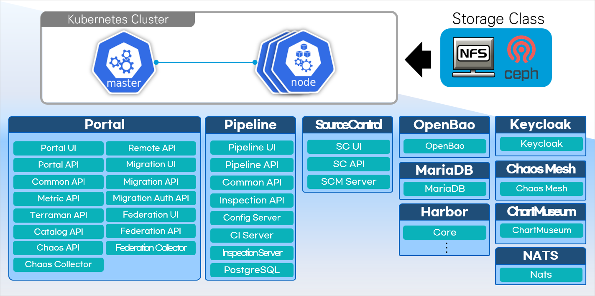

### [Index](https://github.com/K-PaaS/Guide/blob/master/README.md) > [CP Install](/install-guide/Readme.md) > Federation Cluster Container Platform Portal Deployment Guide

<br>

## Table of Contents

1. [Document Overview](#1)  
   1.1. [Purpose](#1.1)  
   1.2. [Scope](#1.2)  
   1.3. [System Architecture](#1.3)  
   1.4. [References](#1.4)

2. [Notes](#2)  
   2.1 [Prerequisite](#2.1)  
   2.2. [Firewall Information](#2.2)    
   2.3. [Installation List](#2.3)

3. [Deploy Container Platform Portal](#3)   
   3.1. [Download Container Platform Portal deployment files](#3.1)  
   3.2. [Define Container Platform Portal variables](#3.2)  
   3.3. [Configure federation member cluster settings](#3.3)  
   3.4. [Run the Container Platform Portal deployment script](#3.4)  
   3.5. [(Note) Delete Container Platform Portal resources](#3.5)  

5. [Access the Container Platform Portal](#4)      
   4.1. [Sign in with the Container Platform Portal admin account](#4.1)      
   4.2. [Sign in with a Container Platform Portal user account](#4.2)      
   4.3. [Container Platform Portal user guide](#4.3)

6. [Container Platform Portal Notes](#5)       
   5.1. [Cautions when creating Kubernetes resources](#5.1)

<br>

## <span id='1'>1. Document Overview
### <span id='1.1'>1.1. Purpose
This document (Federation Cluster Container Platform Portal Deployment Guide) describes how to deploy the Container Platform Portal in a federation-based host/member cluster environment. <br><br>

### <span id='1.2'>1.2. Scope
This guide is written for an environment composed of a federation host cluster and one or more member clusters.

<br>

### <span id='1.3'>1.3. System Architecture
<p align="center"></p>

The system is composed of a **Kubernetes Cluster (Master, Worker)** environment and a storage server for data management.
On a Kubernetes cluster installed via Kubespray, the middleware components below are provided as containers: **OpenBao** (secrets and authentication data), **MariaDB (RDBMS)** (metadata), **Harbor** (container images), **Keycloak** (portal user authentication),
**ChartMuseum** (Helm charts), **Chaos Mesh** (fault simulation in Kubernetes), and **NATS** (federation cluster status/metrics delivery), etc.
The required VM environment is **1 Master VM and at least 3 Worker VMs**, and this document focuses on deploying the Container Platform Portal environment onto the Kubernetes cluster.

<br>    

### <span id='1.4'>1.4. References
> https://kubernetes.io/ko/docs<br>

<br>

## <span id='2'>2. Notes

### <span id='2.1'>2.1. Prerequisite
This installation guide is based on an **Ubuntu 22.04** environment.

#### Federation-based host/member cluster environment
To deploy the Container Platform Portal, a federation-based host cluster must be prepared in advance. <br>
If needed, you can configure and connect member clusters. If member clusters are not available, you may skip that step.

For cluster installation/configuration procedures, refer to the guide below.
> [Federation Cluster Configuration Guide](../standalone/cp-cluster-install-federation.md)

<br>

### <span id='2.2'>2.2. Firewall Information
Configure your IaaS security group to allow the following ports.

- Master Node

| <center>Protocol</center> | <center>Port</center> | <center>Notes</center> |  
| :---: | :---: | :--- |  
| TCP | 111 | NFS PortMapper |  
| TCP | 2049 | NFS |  
| TCP | 2379-2380 | etcd server client API |  
| TCP | 6443 | Kubernetes API Server |  
| TCP | 10250 | Kubelet API |  
| TCP | 10251 | kube-scheduler |  
| TCP | 10252 | kube-controller-manager |  
| TCP | 10255 | Read-Only Kubelet API |  
| UDP | 4789 | Calico networking VXLAN |  

- Worker Node

| <center>Protocol</center> | <center>Port</center> | <center>Notes</center> |  
| :--- | :---: | :--- |  
| TCP | 111 | NFS PortMapper |  
| TCP | 2049 | NFS |  
| TCP | 10250 | Kubelet API |  
| TCP | 10255 | Read-Only Kubelet API |  
| TCP | 30000-32767 | NodePort Services |  
| UDP | 4789 | Calico networking VXLAN |  

<br>

### <span id='2.3'>2.3. Installation List
The services deployed as part of the Container Platform Portal are as follows.

|Service|Application Version|Chart Version|
|:--- | :---:|  :--- |  
|[OpenBao](https://github.com/openbao/openbao)|v2.4.1|0.19.0|
|[MariaDB](https://github.com/mariadb)|12.0.2|23.2.1 (Bitnami)|
|[Harbor](https://github.com/goharbor/harbor)|2.14.0|1.18.0|
|[Keycloak](https://github.com/keycloak/keycloak)|26.3.3|25.2.0 (Bitnami)|
|[ChartMuseum](https://github.com/helm/chartmuseum)|0.16.3|3.10.4|
|[Chaos Mesh](https://github.com/chaos-mesh/chaos-mesh)|2.8.0|2.8.0|
|[NATS](https://github.com/nats-io/nats-server)|2.11.8|9.0.28 (Bitnami)|

<br>

## <span id='3'>3. Deploy Container Platform Portal

### <span id='3.1'>3.1. Download Container Platform Portal deployment files
To deploy the Container Platform Portal, download the deployment files and place them in the path below.<br>
:bulb: This section is performed on the **Master Node**.

+ Download the Container Platform Portal deployment files:
  [cp-portal-deployment-v1.7.0.tar.gz](https://nextcloud.k-paas.org/index.php/s/qrApL4sP5eC2WMX/download)

```bash
# Create a directory for downloads
$ mkdir -p ~/workspace/container-platform
$ cd ~/workspace/container-platform

# Download the deployment file and verify the path
$ wget --content-disposition https://nextcloud.k-paas.org/index.php/s/qrApL4sP5eC2WMX/download

$ ls ~/workspace/container-platform
  cp-portal-deployment-v1.7.0.tar.gz

# Extract the archive
$ tar -xvf cp-portal-deployment-v1.7.0.tar.gz
```

- Deployment file directory structure
```bash
cp-portal-deployment
├── script          # (single) variables and scripts for portal deployment
├── script_mc       # (multi) variables and scripts for portal deployment
├── script_fed      # (federation) variables and scripts for portal deployment
├── values_orig     # Helm chart values files
├── secmg_orig      # Secret management system deployment files
└── istio_mc        # Istio service mesh related files
```

<br>

### <span id='3.2'>3.2. Define Container Platform Portal variables
Define the variable values required for deploying the Container Platform Portal.
```bash
$ cd ~/workspace/container-platform/cp-portal-deployment/script
$ vi cp-portal-vars.sh
```

```bash
# COMMON VARIABLE (Please change the value of the variables below.)
K8S_MASTER_NODE_IP="{k8s master node public ip}"                     # Kubernetes Master Node Public IP
K8S_CLUSTER_API_SERVER="https://${K8S_MASTER_NODE_IP}:6443"          # kubernetes API Server (e.g. https://${K8S_MASTER_NODE_IP}:6443)
K8S_STORAGECLASS="cp-storageclass"                                   # Kubernetes StorageClass Name (e.g. cp-storageclass)
HOST_CLUSTER_IAAS_TYPE="1"                                           # Kubernetes Cluster IaaS Type ([1] AWS, [2] OPENSTACK, [3] NAVER, [4] NHN, [5] KT)
HOST_DOMAIN="{host domain}"                                          # Host Domain (e.g. xx.xxx.xxx.xx.nip.io)
```

```bash
# (Example)
K8S_MASTER_NODE_IP="103.xxx.xxx.xxx"
K8S_CLUSTER_API_SERVER="https://${K8S_MASTER_NODE_IP}:6443"
K8S_STORAGECLASS="cp-storageclass"
HOST_CLUSTER_IAAS_TYPE="2"
HOST_DOMAIN="105.xxx.xxx.xxx.nip.io"
```

|Variable|Description|Details|
|---|---|---|
|**K8S_MASTER_NODE_IP**|Kubernetes Master Node<br>Public IP|If the Master Node is not reachable from your environment,<br>you can enter a Worker Node public IP instead.| 
|**K8S_CLUSTER_API_SERVER**|Kubernetes API Server URL|For clusters deployed via the container platform, the default is<br>`https://${K8S_MASTER_NODE_IP}:6443`.<br>If your Master Node does not accept traffic on port 6443 in this form, update the value.<br><br>:small_blue_diamond:**If using an HA control plane**<br>Enter `https://{Load Balancer IP or Domain}:6443`.| 
|**K8S_STORAGECLASS**|StorageClass name|For clusters deployed via the container platform, the default is<br>`cp-storageclass`.<br>If you use a different StorageClass, enter its resource name.| 
|**HOST_CLUSTER_IAAS_TYPE**|Kubernetes cluster IaaS type|Enter one of: [1] AWS [2] OPENSTACK [3] NAVER [4] NHN [5] KT| 
|**HOST_DOMAIN**|Host domain value|Enter `{EXTERNAL-IP of ingress-nginx-controller service}.nip.io`<br>See [HOST_DOMAIN](#host_domain).|

#### Look up
```bash
# Look up Kubernetes API Server
## If the API server is not reachable via the Master Node's :6443
$ kubectl config view
apiVersion: v1
clusters:
- cluster:
    certificate-authority-data: DATA+OMITTED
    server: https://63c4f2d9-xxxx.xxxx.com (enter this)

# Look up StorageClass
$ kubectl get storageclass 
NAME                   PROVISIONER
block-storage (enter)  blk.csi...
```

#### HOST_DOMAIN
Use the Ingress NGINX Controller service <b>EXTERNAL-IP</b> (an IP accessible from outside) and the free wildcard DNS service <b>nip.io</b>.<br>

In a single-cluster environment, the Container Platform Portal routes services through Kubernetes Ingress resources. The following two services are included during cluster installation for this purpose.<br>
> <b>[MetalLB](https://metallb.universe.tf/)</b> (provides LoadBalancer functionality for bare-metal clusters)<br>
> <b>[Ingress NGINX Controller](https://kubernetes.github.io/ingress-nginx/)</b> (Ingress controller for Kubernetes)<br>

If the EXTERNAL-IP assigned to the Ingress NGINX Controller service via MetalLB is not reachable from outside,<br>
you may need to create a network interface for that IP in your cloud provider, attach a floating IP, and/or attach an interface to the cluster node, etc.

```bash
# Look up the EXTERNAL-IP of 'ingress-nginx-controller' service (LoadBalancer type)
$ kubectl get svc -n ingress-nginx
NAME                        TYPE           CLUSTER-IP      EXTERNAL-IP            PORT(S)                      AGE
ingress-nginx-controller    LoadBalancer   10.233.49.255   192.168.0.xxx (check)  80:30465/TCP,443:32226/TCP   26h

# curl from outside to EXTERNAL-IP (connection fails)
$ curl http://192.168.0.xxx
curl: (28) Failed to connect to 192.168.0.xxx port 80

# In your cloud service: create interface, attach floating IP, attach interface to cluster node, etc.
192.168.0.xxx -> 105.xxx.xxx.xxx (floating IP)

# curl from outside to the floating IP (404 is OK and indicates connectivity)
$ curl http://105.xxx.xxx.xxx
<html>
<head><title>404 Not Found</title></head>
<body>
<center><h1>404 Not Found</h1></center>
<hr><center>nginx</center>
</body>
</html>

# Set host domain value using nip.io for the connected floating IP
HOST_DOMAIN="105.xxx.xxx.xxx.nip.io"
```

#### TLS_CERT_AUTO_GENERATED
##### :bulb: All services deployed by the Container Platform Portal are configured to use **HTTPS**. <br>
During portal deployment, TLS certificates are automatically generated based on the HOST_DOMAIN value.  
If you already have certificates and want to use them, modify the variables below.

```bash
# If using existing certificates
...
# TLS_CERT (move to the commented section)
TLS_CERT_AUTO_GENERATED="N"  # Change to N
TLS_CERT_PATH="/home/ubuntu/tls/mydomain.crt"  # Absolute path to the host_domain .crt file
TLS_KEY_PATH="/home/ubuntu/tls/mydomain.key"   # Absolute path to the host_domain .key file
```

<details>
<summary><h4> ⚠️ [Notes] Installing the portal on a container runtime environment other than CRI-O </h4></summary>
<h1></h1>

The default container runtime installed with K-PaaS clusters is **CRI-O (crio)**. If you installed your cluster using K-PaaS, you can skip this section.  
However, if you install the portal on a cluster using another runtime (e.g., containerd), you must update the settings below.

<br>

**Chaos Mesh**, which is deployed together during portal installation, requires container runtime settings.  
Check the runtime and socketPath for your cluster environment and update the values below before installing.

**Reference settings**

> This guide is for reference. For the most accurate and latest information, refer to [[Install Chaos Mesh in different environments]](https://chaos-mesh.org/docs/production-installation-using-helm/#step-4-install-chaos-mesh-in-different-environments).

| Runtime      | runtime value | socketPath example                 |
|--------------|--------------|-----------------------------------|
| CRI-O        | `crio`       | `/var/run/crio/crio.sock`         |
| containerd   | `containerd` | `/run/containerd/containerd.sock` |

#### Update runtime and socketPath

```bash
$ cd ~/workspace/container-platform/cp-portal-deployment/values_orig
$ vi chaos-mesh.yaml
```

```yaml
···
chaosDaemon:
  runtime: crio # change
  socketPath: /var/run/crio/crio.sock # change
···
```

<h1></h1>
</details>

<br>

### <span id='3.3'>3.3. Configure federation member cluster settings
> If member clusters are not prepared, you can skip this configuration step.

To configure member cluster information, the target cluster contexts must already be set in `kubectl config`.  
Prepare contexts that can access each cluster in advance.

:loudspeaker: Ensure that the cluster, context, and user names in each kubeconfig file do not overlap.

```bash
# Create and move to the .kube directory
$ mkdir -p ${HOME}/.kube
$ cd ${HOME}/.kube

# Example kubeconfig file locations (file names are examples)
$ ls ${HOME}/.kube
host.config  member1.config  member2.config

# Set kubeconfig file paths
$ export KUBECONFIG="${HOME}/.kube/host.config:${HOME}/.kube/member1.config:${HOME}/.kube/member2.config"
```

##### :bulb: Verify that `NAME`, `CLUSTER`, and `AUTHINFO` print correctly
```bash
# List contexts
$ kubectl config get-contexts
CURRENT   NAME      CLUSTER   AUTHINFO   NAMESPACE
*         host      host      host
          member1   member1   member1
          member2   member2   member2
```

##### Verify access to member clusters
```bash
$ kubectl get nodes --context=member1
NAME        STATUS   ROLES           AGE   VERSION
cp-mem1-1   Ready    control-plane   2d    v1.33.5
cp-mem1-2   Ready    <none>          2d    v1.33.5

$ kubectl get nodes --context=member2
NAME                    STATUS   ROLES    AGE   VERSION
default-worker-node-0   Ready    <none>   2d    v1.33.4
default-worker-node-1   Ready    <none>   2d    v1.33.4
default-worker-node-2   Ready    <none>   2d    v1.33.4
```

Run the script below to configure the number of member clusters to register and each cluster’s information. <br>
When you run the script, it generates a config file filled with the detected API server and cluster name based on the selected contexts.

```bash
$ cd ~/workspace/container-platform/cp-portal-deployment/script_fed
$ chmod +x gen-cluster-config.sh
$ ./gen-cluster-config.sh
```

```bash
# Selected contexts are automatically excluded from later selection lists to prevent duplicates.
# Example: registering 2 member clusters

▶ Member Cluster Configuration Generator
How many member clusters do you want to register? (1-10): 2

You selected 2 member cluster(s).

▶ Select context for cluster 1
  1) host
  2) member1
  3) member2
Enter the number of the context for cluster 1: 2  # select context
Selected context       : member1
Cluster name in config : member1
Detected API server    : https://xxx.xxx.xxx.xxx:6443

▶ Select context for cluster 2
  1) host
  2) member2
Enter the number of the context for cluster 2: 2  # select context
Selected context       : member2
Cluster name in config : member2
Detected API server    : https://default.container.com:6443

Configuration written to: member-cluster-config.sh
Please review API_SERVER, NAME, and fill IAAS_TYPE before deployment.
```

After running the script, `member-cluster-config.sh` is created with default values populated based on the selected contexts. <br>
:bulb: Update the API server endpoint and cluster name as needed for your environment, and **IAAS_TYPE must be filled in manually.**

```bash
$ vi member-cluster-config.sh
```

```bash
# Auto-generated member cluster config
# Edit API_SERVER or NAME if needed, and fill IAAS_TYPE manually.

# Cluster 1
CLUSTER1_CTX="member1"
CLUSTER1_API_SERVER="https://xxx.xxx.xxx.xxx:6443"   # Auto-detected. Change if using a different endpoint.
CLUSTER1_NAME="member1"                              # Auto-detected. Change if naming differs from your env.
CLUSTER1_IAAS_TYPE="1"                               # Fill manually (1 OPENSTACK, 2 NAVER, 3 NHN, 4 KT)

# Cluster 2
CLUSTER2_CTX="member2"
CLUSTER2_API_SERVER="https://default.container.com:6443"   # Auto-detected. Change if using a different endpoint.
CLUSTER2_NAME="member2"                                    # Auto-detected. Change if naming differs from your env.
CLUSTER2_IAAS_TYPE="3"                                     # Fill manually (1 OPENSTACK, 2 NAVER, 3 NHN, 4 KT)
```

<br>

### <span id='3.4'>3.4. Run the Container Platform Portal deployment script
The deployment script installs only the portal components by default. To include the member cluster registration feature, run it with the `--join` option.

```bash
$ cd ~/workspace/container-platform/cp-portal-deployment/script_fed
$ chmod +x deploy-cp-portal-fed.sh
```

* Install portal only
```bash
$ ./deploy-cp-portal-fed.sh
```

* Install portal including member cluster registration
```bash
$ ./deploy-cp-portal-fed.sh --join
```

<br>

Verify that Container Platform Portal resources have been deployed correctly.<br>
For Pods, it may take a few seconds to transition to Running after being bound to a node and containers are created.<br>

> **Keycloak** may take several minutes for initial startup. During this period, UI components that use OIDC may repeatedly restart because the authentication server is not ready. Once Keycloak becomes Ready, the system will stabilize gradually.

<br>

- **Check OpenBao Pods**
>`$ kubectl get pods -n openbao`
```bash
NAME                                      READY   STATUS    RESTARTS   AGE
openbao-0                                 1/1     Running   0          6m12s
openbao-agent-injector-59777b5b64-zz27b   1/1     Running   0          6m12s
```

- **Check MariaDB Pods**
>`$ kubectl get pods -n mariadb`
```bash
NAME        READY   STATUS    RESTARTS   AGE
mariadb-0   1/1     Running   0          6m24s
```    

- **Check Harbor Pods**
>`$ kubectl get pods -n harbor`
```bash
NAME                                 READY   STATUS    RESTARTS   AGE
harbor-core-bd5d959b4-5tptp          1/1     Running   0          6m29s
harbor-database-0                    1/1     Running   0          6m29s
harbor-jobservice-76f4ccd496-j4jlx   1/1     Running   0          6m29s
harbor-portal-645d97998c-s4jr5       1/1     Running   0          6m29s
harbor-redis-0                       1/1     Running   0          6m29s
harbor-registry-78c8bbf446-85twg     2/2     Running   0          6m29s
harbor-trivy-0                       1/1     Running   0          6m29s
```  

- **Check Keycloak Pods**
>`$ kubectl get pods -n keycloak`
```bash
NAME         READY   STATUS    RESTARTS   AGE
keycloak-0   1/1     Running   0          5m54s
keycloak-1   1/1     Running   0          5m53s
```

- **Check Container Platform Portal Pods**
>`$ kubectl get pods -n cp-portal`
```bash
NAME                                                         READY   STATUS    RESTARTS   AGE
cp-portal-api-deployment-6b5c84fbdf-jhnpl                    1/1     Running   0          5m29s
cp-portal-catalog-api-deployment-85795db844-snwkn            1/1     Running   0          5m28s
cp-portal-chaos-api-deployment-68f8dc64fc-6kh85              1/1     Running   0          5m28s
cp-portal-chaos-collector-deployment-859df489f4-7vg6l        1/1     Running   0          5m29s
cp-portal-common-api-deployment-59f65d7dd6-z9j2p             1/1     Running   0          5m29s
cp-portal-federation-api-deployment-755cdc5b8-zz2q2          1/1     Running   0          5m29s
cp-portal-federation-collector-deployment-7b8c8ff7bf-vq6cz   1/1     Running   0          5m29s
cp-portal-federation-ui-deployment-869fd6c6b9-gvlsd          1/1     Running   0          5m29s
cp-portal-metric-api-deployment-756b4585d5-72wjx             1/1     Running   0          5m29s
cp-portal-migration-api-deployment-9b79789c6-5f5q2           1/1     Running   0          5m29s
cp-portal-migration-auth-deployment-96995bc65-hckg7          1/1     Running   0          5m29s
cp-portal-migration-ui-deployment-c5948cc9c-v7tz9            1/1     Running   0          5m29s
cp-portal-remote-api-deployment-788f46bc9d-kmdbs             1/1     Running   0          5m29s
cp-portal-terraman-deployment-57dd8649cd-rjmqv               1/1     Running   0          5m29s
cp-portal-ui-deployment-7df6cbc75c-nbxnc                     1/1     Running   0          5m29s
nats-0                                                       1/1     Running   0          5m32s
```

- **Check ChartMuseum Pods**
>`$ kubectl get pods -n chartmuseum`
```bash
NAME                           READY   STATUS    RESTARTS   AGE
chartmuseum-648968c7dd-ck2k2   1/1     Running   0          6m27s
```  

- **Check Chaos Mesh Pods**
>`$ kubectl get pods -n chaos-mesh`
```bash
NAME                                        READY   STATUS    RESTARTS   AGE
chaos-controller-manager-7c4857547f-r7mcv   1/1     Running   0          6m10s
chaos-daemon-48768                          1/1     Running   0          6m11s
chaos-daemon-8r86r                          1/1     Running   0          6m10s
chaos-daemon-wz8gk                          1/1     Running   0          6m11s
chaos-dashboard-799b6d9f6-2njzr             1/1     Running   0          6m10s
chaos-dns-server-5f9bb85c75-hcjlr           1/1     Running   0          6m10s
```

- **Check Hosts for service access**
>`$ kubectl get ingress -A`
```bash
NAMESPACE     NAME                CLASS   HOSTS                                ADDRESS         PORTS     AGE
chartmuseum   chartmuseum         nginx   chartmuseum.xxx.xxx.xxx.xxx.nip.io   172.xx.xx.xxx   80, 443   6m51s
cp-portal     cp-portal-ingress   nginx   portal.xxx.xxx.xxx.xxx.nip.io        172.xx.xx.xxx   80, 443   6m15s
harbor        harbor-ingress      nginx   harbor.xxx.xxx.xxx.xxx.nip.io        172.xx.xx.xxx   80, 443   7m44s
keycloak      keycloak            nginx   keycloak.xxx.xxx.xxx.xxx.nip.io      172.xx.xx.xxx   80, 443   6m52s
openbao       openbao             nginx   openbao.xxx.xxx.xxx.xxx.nip.io       172.xx.xx.xxx   80, 443   7m55s
```

<br>

#### <span id='3.5'>3.5. (Note) Delete Container Platform Portal resources
※ This script deletes only portal-related resources and does not affect federation system components.

If you want to delete the deployed portal resources, run the script below.<br>
:loudspeaker: (Caution) Running this script while the portal is in operation will **delete resources required for portal operation**, so use it carefully.<br>
> If the StorageClass type of the cluster installed via the container platform is `NFS`, the reclaim policy is `Retain`.<br>
> With `Retain`, even if you delete the Persistent Volume, the data still exists on the NFS storage server,<br>
> so you must clean up data manually.

```bash
$ cd ~/workspace/container-platform/cp-portal-deployment/script_fed
$ chmod +x uninstall-cp-portal-fed.sh
$ ./uninstall-cp-portal-fed.sh
Are you sure you want to delete the container platform portal? <y/n> y # enter y
```

<br>    

## <span id='4'>4. Access the Container Platform Portal
Access the Container Platform Portal.<br><br>

**Container Platform Portal URL** : `https://portal.${HOST_DOMAIN}`
+ Enter the `HOST_DOMAIN` value defined in [[3.2. Define Container Platform Portal variables]](#3.2)

<br>

### <span id='4.1'/>4.1. Sign in with the Container Platform Portal admin account
The admin account requires an initial password reset. Follow the steps below.

<details>
<summary><h4> :key: Set the Container Platform Portal admin account password </h4></summary>

<h1></h1>  

### 1. Look up Keycloak Admin account information
You can check the Keycloak Admin account information using the commands below.

```bash
# Look up Keycloak Admin Username
$ kubectl get secret cp-portal-secret -n cp-portal -o jsonpath="{.data.KEYCLOAK_ADMIN_USERNAME}" | base64 -d; echo
# Look up Keycloak Admin Password
$ kubectl get secret cp-portal-secret -n cp-portal -o jsonpath="{.data.KEYCLOAK_ADMIN_PASSWORD}" | base64 -d; echo
```

<br>

### 2. Access and sign in to the Keycloak Admin Console
Access the Keycloak Admin Console and sign in with the Keycloak Admin account retrieved above.<br><br>

**Keycloak Admin Console URL** : `https://keycloak.${HOST_DOMAIN}`
+ Enter the `HOST_DOMAIN` value defined in [[3.2. Define Container Platform Portal variables]](#3.2)

![image 011]

<br>

### 3. Reset the Container Platform Portal admin account password
- Change the Realm (top-left) to `Cp-realm`.

![image 012]

- Select the [Users] menu, then click the user whose Username is `admin`.

![image 013]

- Select the [Credentials] menu, then click [Reset password] to reset the password.
    + **Password** : `Enter the password to set`
    + **Temporary** : Select `Off`
        - If set to 'On', the user must change the password again on next sign-in.

![image 014]
![image 015]

<h1></h1>

</details>

- Sign in to the Container Platform Portal with the admin account.
    + **Username** : `admin`
    + **Password** : `The password you reset`

![image 002]

<br>

### <span id='4.2'/>4.2. Sign in with a Container Platform Portal user account
#### User registration
- Click the 'Register' button at the bottom.

![image 003]

- Enter the account information to register, then click 'Register' to sign up for the portal.

![image 004]

- After signing up, you cannot access the portal immediately. You must receive a Namespace and Role assignment from the admin before you can use the portal.
  For Namespace and Role assignment, refer to [[4.3. Container Platform user/operator portal guide]](#4.3).

![image 005]

#### User sign-in
- Sign in to the portal with the account you registered.

![image 006]

<br>    

### <span id='4.3'/>4.3. Container Platform Portal user guide
- For how to use the Container Platform Portal, refer to the guide below.
    + [Container Platform Portal User Guide](../../use-guide/portal/cp-portal-use-guide.md)

<br>

## <span id='5'>5. Container Platform Portal Notes

### <span id='5.1'>5.1. Cautions when creating Kubernetes resources

When creating resources while using the container platform, be careful not to use the following prefixes.

|Resource|Prefixes to avoid when creating|
|---|---|
|All resources|kube*|
|Namespace|all|
||kubernetes-dashboard|
||cp-portal-temp-namespace|
|Role|cp-init-role|
||cp-admin-role|
|ResourceQuota|cp-low-resourcequota|
||cp-medium-resourcequota|
||cp-high-resourcequota|
|LimitRanges|cp-low-limitrange|
||cp-medium-limitrange|
||cp-high-limitrange|
|Pod|nodes|
||resources|

<br>

### [Index](https://github.com/K-PaaS/Guide/blob/master/README.md) > [CP Install](/install-guide/Readme.md) > Federation Cluster Container Platform Portal Deployment Guide

[image 001]:../images/portal/cp-001.png
[image 002]:../images/portal/cp-002.png
[image 003]:../images/portal/cp-003.png
[image 004]:../images/portal/cp-004.png
[image 005]:../images/portal/cp-005.png
[image 006]:../images/portal/cp-006.png
[image 007]:../images/portal/cp-007.png
[image 008]:../images/portal/cp-008.png
[image 009]:../images/portal/cp-009.png
[image 010]:../images/portal/cp-010.png
[image 011]:../images/portal/cp-011.png
[image 012]:../images/portal/cp-012.png
[image 013]:../images/portal/cp-013.png
[image 014]:../images/portal/cp-014.png
[image 015]:../images/portal/cp-015.png
[image 016]:../images/portal/cp-016.png
[image 017]:../images/portal/cp-017.png
[image 018]:../images/portal/cp-018.png
[image 019]:../images/portal/cp-019.png
[image 020]:../images/portal/cp-020.png
[image 021]:../images/portal/cp-021.png
