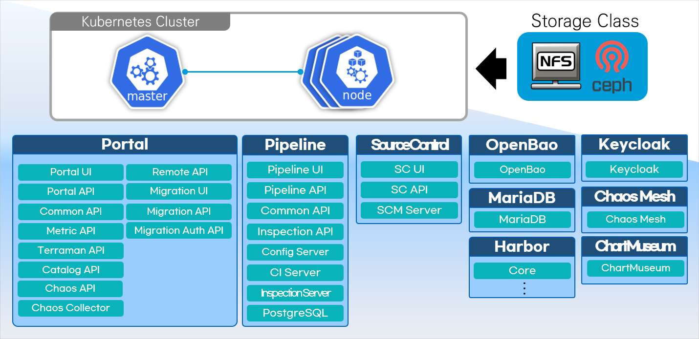

### [Index](https://github.com/K-PaaS/cp-guide-eng/blob/master/README.md) > [CP Install](/install-guide/README.md) > SourceControl Installation Guide

<br>

## Table of Contents

1. [Document Overview](#1)<br>
     1.1. [Purpose](#1.1)<br>
     1.2. [Scope](#1.2)<br>
     1.3. [System configuration diagram](#1.3)<br>
     1.4. [Reference Material](#1.4)<br>

2. [Prerequisite](#2)<br>
     2.1. [Install the Container Platform Portal](#2.1)<br>
        
3. [Container platform source control deployment](#3)<br>
     3.1. [Download container platform source control Deployment file](#3.1)<br>
     3.2. [Define container platform source control variables](#3.2)<br>
     3.3. [Run the Container Platform source control deployment script](#3.3)<br>
     3.4. [(Reference) Delete Container Platform Source Control Resources](#3.4)<br>

4. [Accessing container platform source control](#4)<br>
     4.1. [Container Platform Source Control Administrator Login](#4.1)<br>
     4.2. [Container Platform source control user account login](#4.2)<br>
     4.3. [Container Platform Source Control Use Guide](#4.3)<br>


## <div id='1'>1. Document Overview
### <div id='1.1'>1.1. Purpose
This document (Container Platform Source Control Deployment Guide) describes how to install the Kubernetes cluster and Container Platform portal and deploy source control.

<br>

### <div id='1.2'>1.2. Scope
The installation scope is based on a Kubernetes cluster deployment.

<br>

### <div id='1.3'>1.3. System configuration diagram
<p align="center"></p>

<br>

The system configuration consists of a **Kubernetes Cluster (Master, Worker)** environment and a storage server for data management. Harbor** to manage the Container Platform source control image and Helm Chart in the Kubernetes Cluster environment installed via Kubespray,
Keycloak, which manages Container Platform Source Control user authentication, and MariaDB (RDBMS), which manages Container Platform Source Control metadata, are provided through the Container Platform portal.
Container Platform Source Control provides SCM-Server, which manages sources, as a container. The total required VM environment is **Master VM: 1, Worker VM: 3 or more** and this document is about deploying the Container Platform Source Control environment on Kubernetes Cluster.

<br>

### <div id='1.4'>1.4. Reference Material
> https://kubernetes.io/docs/home/

<br>

## <div id='2'>2. Prerequisite
    
### <div id='2.1'>2.1. Install the Container Platform Portal
The infrastructure that will be used by Container Platform Source Control must be installed beforehand, including the certifier **KeyCloak**, database **MariaDB**, and repository server **Harbor**.
The Container Platform Portal deployment will install all of that infrastructure, so refer to the guide below for pre-installation.

##### Single-cluster environments
> [[Single Cluster Container Platform Portal Deployment Guide]](../portal/cp-portal-standalone-guide.md)
##### Multi-cluster environments
> [[Multi-Cluster Container Platform Portal Deployment Guide]](../portal/cp-portal-standalone-guide-mc.md)

<br>
    
## <div id='3'>3. Container platform source control deployment
### <div id='3.1'>3.1. Download container platform source control Deployment file
Download the Deployment file for your Container Platform source control deployment and place it in the path below.<br>
##### :bulb: This will be done on the **Master Node**. <br>
> For multi-cluster environments, proceed on the cluster you specified as **Cluster1** when deploying the Container Platform Portal.

+ Download Container Platform Source Control Deployment File:
  [cp-source-control-deployment-v1.6.2.tar.gz](https://nextcloud.k-paas.org/index.php/s/TewcbsNdm2EQmtX/download)

```bash
# Create a path to download the Deployment file
$ mkdir -p ~/workspace/container-platform
$ cd ~/workspace/container-platform

# Download the Deployment file and verify the file path
$ wget --content-disposition https://nextcloud.k-paas.org/index.php/s/TewcbsNdm2EQmtX/download

$ ls ~/workspace/container-platform
  cp-source-control-deployment-v1.6.2.tar.gz ...
  
# Extract the Deployment file
$ tar -xvf cp-source-control-deployment-v1.6.2.tar.gz
```

- Configure the Deployment file directory
```bash
cp-source-control-deployment
 ├── script        # Variable and script file locations for source control deployments
 └── values_orig   # Helm chart values file location
```

<br>

### <div id='3.2'>3.2. Define container platform source control variables
Defining variable values is required before deploying container platform source control. Check the information required for your deployment to set the variables.

```bash
$ cd ~/workspace/container-platform/cp-source-control-deployment/script
$ vi cp-source-control-vars.sh
```
```bash                                                    
# COMMON VARIABLE (Please change the value of the variables below.)
HOST_DOMAIN="{host domain}"                           # Host Domain (e.g. xx.xxx.xxx.xx.nip.io)
K8S_STORAGECLASS="cp-storageclass"                    # Kubernetes StorageClass Name (e.g. cp-storageclass)
IS_MULTI_CLUSTER="N"                                  # Please enter "Y" if deploy in a multi-cluster environment
```
```bash
# (예시)
HOST_DOMAIN="105.xxx.xxx.xxx.nip.io"
K8S_STORAGECLASS="cp-storageclass"
IS_MULTI_CLUSTER="N"
```
|Variable|Description|Details|
|---|---|---|
|**HOST_DOMAIN**|Enter a value for Host Domain|Enter the `HOST_DOMAIN` value defined in <br>[[3.2. Define Container Platform Portal Variables]](../portal/cp-portal-standalone-guide.md#3.2)|
|**K8S_STORAGECLASS**|Enter a name for the StorageClass|Clusters deployed via the Container Platform default to `cp-storageclass`. <br> If you want to use a different StorageClass, enter the corresponding resource name.|
|**IS_MULTI_CLUSTER**|Whether you have a multi-cluster environment|Enter "Y" if deploying in a multi-cluster environment|
<br>
    
### <div id='3.3'>3.3. Run the Container Platform source control deployment script
Run the deployment script for deploying container platform source control.

```bash
$ chmod +x deploy-cp-source-control.sh
$ ./deploy-cp-source-control.sh
```

<br>

Verify that the container platform source control-related resources are deployed properly.<br>
For Resource Pods, it takes a few seconds after binding to a Node and creating the container to transition to the Running state.

#### Look up container platform source control resources

```bash
$ kubectl get all -n cp-source-control
```

```bash
NAME                                                       READY   STATUS    RESTARTS   AGE
pod/cp-source-control-api-deployment-8565cf8dd7-nz7ds      1/1     Running   0          27s
pod/cp-source-control-manager-deployment-df5fd8bd8-2c2l4   1/1     Running   0          28s
pod/cp-source-control-ui-deployment-5fd69d4b59-mv5w9       1/1     Running   0          27s

NAME                                        TYPE        CLUSTER-IP      EXTERNAL-IP   PORT(S)    AGE
service/cp-source-control-api-service       ClusterIP   10.233.52.12    <none>        8091/TCP   27s
service/cp-source-control-manager-service   ClusterIP   10.233.7.44     <none>        8080/TCP   28s
service/cp-source-control-ui-service        ClusterIP   10.233.58.193   <none>        8094/TCP   27s

NAME                                                   READY   UP-TO-DATE   AVAILABLE   AGE
deployment.apps/cp-source-control-api-deployment       1/1     1            1           27s
deployment.apps/cp-source-control-manager-deployment   1/1     1            1           28s
deployment.apps/cp-source-control-ui-deployment        1/1     1            1           27s

NAME                                                             DESIRED   CURRENT   READY   AGE
replicaset.apps/cp-source-control-api-deployment-8565cf8dd7      1         1         1       27s
replicaset.apps/cp-source-control-manager-deployment-df5fd8bd8   1         1         1       28s
replicaset.apps/cp-source-control-ui-deployment-5fd69d4b59       1         1         1       27s
```    
```bash
# Pod status when deployed in a multi-cluster environment
NAME                                                        READY   STATUS    RESTARTS   AGE
pod/cp-source-control-api-deployment-7d7db8dbbc-k92hn       2/2     Running   0          3m31s
pod/cp-source-control-manager-deployment-855965dd98-7c77k   1/1     Running   0          3m32s
pod/cp-source-control-ui-deployment-845b588b48-74wjc        2/2     Running   0          3m31s
```
<br>

### <div id='3.4'>3.4. (Reference) Delete Container Platform Source Control Resources
To delete a deployed Container Platform source control resource, run the script below.<br>
> :loudspeaker: If the StorageClass type of a cluster installed via a container platform is `NFS`, the reclaim policy is `Retain`.<br>
> The `Retain` policy means that the data still exists on the storage NFS server even after deleting the Persistent Volume, requiring manual data cleanup.
```bash
$ cd ~/workspace/container-platform/cp-source-control-deployment/script
$ chmod +x uninstall-cp-source-control.sh
$ ./uninstall-cp-source-control.sh
Are you sure you want to delete the container platform source control? <y/n> y # Type y
```

<br>

## <div id='4'>4. Accessing container platform source control
Access the container platform source control.<br><br>
**Container platform source control URL** : `https://scm.${HOST_DOMAIN}`
+ Enter the `HOST_DOMAIN` value as defined in the [[3.2. Defining Container Platform source control variables]](#3.2)

<br>

### <div id='4.1'/>4.1. Container Platform Source Control Administrator Login
Log in to source control with your Container Platform Portal administrator account.
> [[(Reference) Container Platform Portal admin account login]](../portal/cp-portal-standalone-guide.md#4.1)
+ **Username** : `admin`
+ **Password** : `Initialized password value`

![image 002]

<br>    

### <div id='4.2'/>4.2. Container Platform source control user account login
#### User registration
- Click the 'Register' button at the bottom.

![image 003]

- Enter the user account information to register and click the 'Register' button to sign up for Container Platform source control.

![image 004]

#### 사용자 로그인
- Log in to the Container Platform source control with the account you registered through Sign Up.

![image 006]

<br>

### <div id='4.3'/>4.3. Container Platform Source Control Use Guide
- To learn how to use Container Platform source control, see the user guide below.
     + [Container Platform Source Control Use Guide](../../use-guide/source-control/cp-source-control-use-guide.md)

<br>

### [Index](https://github.com/K-PaaS/cp-guide-eng/blob/master/README.md) > [CP Install](/install-guide/README.md) > SourceControl Installation Guide

[image 001]:../images/portal/cp-001.png
[image 002]:../images/portal/cp-002.png
[image 003]:../images/portal/cp-003.png
[image 004]:../images/portal/cp-004.png
[image 005]:../images/portal/cp-005.png
[image 006]:../images/portal/cp-006.png
[image 007]:../images/portal/cp-007.png
[image 008]:../images/portal/cp-008.png
[image 009]:../images/portal/cp-009.png
[image 010]:../images/portal/cp-010.png
[image 011]:../images/portal/cp-011.png
[image 012]:../images/portal/cp-012.png
[image 013]:../images/portal/cp-013.png
[image 014]:../images/portal/cp-014.png
[image 015]:../images/portal/cp-015.png
[image 016]:../images/portal/cp-016.png
[image 017]:../images/portal/cp-017.png
[image 018]:../images/portal/cp-018.png
[image 019]:../images/portal/cp-019.png
[image 020]:../images/portal/cp-020.png
[image 021]:../images/portal/cp-021.png