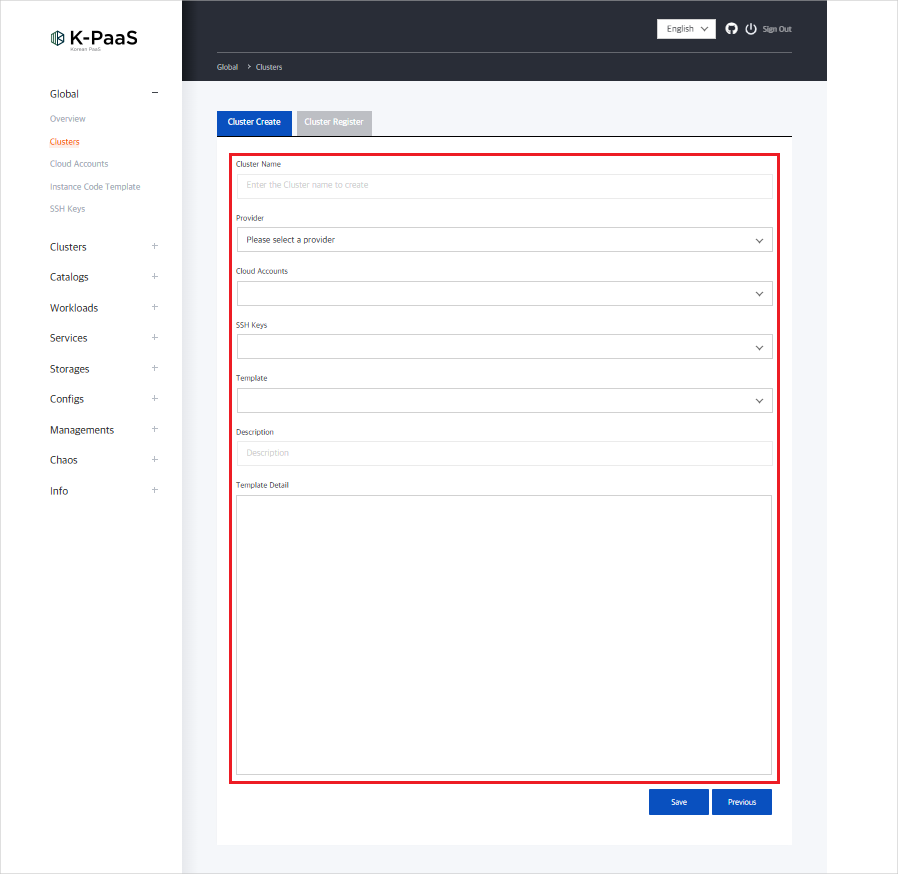

### [Index](https://github.com/K-PaaS/cp-guide-eng/blob/master/README.md) > [CP Use](https://github.com/K-PaaS/cp-guide-eng/blob/master/use-guide/Readme.md) > [Terraman 사용 가이드](../cp-terraman-guide.md) > Terraman 배포 가이드

<br>

## Table of Contents

1. [Documentation Overview](#1)
   1.1. [Purpose](#1.1)
   1.2. [Scope](#1.2)
   1.3. [References](#1.3)
2. [Prerequisite](#2)  
   2.1. [Firewall information](#2.1)
3. [Cluster Deployment Process](#3)
4. [Cloud Accounts](#4)  
   4.1. [Cloud Accounts Registration](#4.1)  
　4.1.1. [NAVER](#4.1.1)
5. [Instance Code Template](#5)  
   5.1. [Instance Code Template Example](#5.1)  
  　5.1.1. [NAVER](#5.1.1)   
   5.2. [Instance Code Template Registration](#5.2)
6. [Clusters](#6)  
   6.1. [Create Clusters](#6.1)

<br>

## <div id='1'> 1. Documentation Overview

### <div id='1.1'> 1.1. Purpose
This document (Terraman Deployment Guide) is intended to describe the Hashicorp Configuration Language (HCL) syntax for each IaaS to create subclusters using **OpenTofu**, and to help users write Infrastructure as Code (IaC) code to deploy subclusters.

|Clusters|Description|
|---|---|
|Host Cluster|The Kubernetes main cluster on a container platform|
|Sub Cluster |A newly created or registered managed cluster through the Container Platform portal|.

### <div id='1.2'> 1.2. Scope
It is based on deploying a Kubernetes Cluster.

### <div id='1.3'> 1.3. References
**Naver Cloud Platform**
> [Ncloud Provider](https://registry.terraform.io/providers/NaverCloudPlatform/ncloud/latest/docs)

<br>

## <div id='2'> 2. Prerequisite
K-PaaS container platform cluster, portal deployment should be done in advance.
> [[K-PaaS Container Platform Cluster Installation Guide]](../../../install-guide/standalone/cp-cluster-install-single.md) <br>
> [[K-PaaS Container Platform Portal Deployment Guide]](../../../install-guide/portal/cp-portal-standalone-guide.md)

### <div id='2.1'> 2.1 About firewalls
- Master Node

|Protocols|Ports|Remarks|
|---|------|---|
|tcp|22|ssh|
|TCP|6443|Kubernetes API Server|
- Open IaaS-specific API firewall
  (Example: OpenStack APIs - 8000, 8774, 5000, 9292, 9876, 9696, 8004, 8780, 8776)
- Instances created on each IaaS must have ports open for remote access.

  <br>
## <div id='3'> 3. Cluster deployment process
To deploy a cluster with the `Root Password` method through Terraman, deploy a subcluster utilizing the **Instance Code Template** through the **Cloud Accounts** setting.
1. [Register Cloud Accounts](#4)
2. [Register Instance Code Template or utilize default IaC code](#5)
3. [Deploy Clusters](#6)


<br>

## <div id='4'> 4. Cloud Accounts
### <div id='4.1'> 4.1 Cloud Accounts Registration
Register your cloud account information in the Container Platform portal menu Global > Cloud Accounts.

#### <div id='4.1.1'> 4.1.1 Naver
Enter the Ncloud information in the fields below.
- You can check the authentication key generation and management information in My page > Account management > Authentication key management in NAVER CLOUD PLATFORM Console.
- The Ncloud Site value is 'public' by default, and you can select and enter 'public', 'gov', or 'fin' depending on the Ncloud domain you are using.

|Domain|Input Value|
|:------:|:------:|
|www.ncloud.com|public|
|www.gov-ncloud.com|gov|
|www.fin-ncloud.com|fin|

<br>

|Topic|About Ncloud|Information location|
|:------:|:------:|:------:|
|accessKey field|Access Key|My Page > Account Management > Manage Authentication Keys|
|secretKey Field|Secret Key|My Page > Account Management > Manage Authentication Keys|
|site field|Site|[See guide](https://registry.terraform.io/providers/NaverCloudPlatform/ncloud/latest/docs#argument-reference)|
|region field|Region|Check your dashboard [see the region name guide](https://guide.ncloud-docs.com/docs/ko/environment-environment-1-1#%EC%A1%B4zone%EC%9D%98-%EC%A2%85%EB%A5%98%EC%99%80-%ED%8A%B9%EC%A7%95)|


<br>

## <div id='5'> 5. Instance Code Template
> By default, there is one Code Template registered for each CSP that is required to create an instance. If you need additional code templates, you can register new ones and use them when creating a cluster.

### <div id='5.1'> 5.1 Instance Code Template Example
#### <div id='5.1.1'> 5.1.1 Naver
This section explains how to create an instance on Ncloud using Terraman. The basic IaC code is focused on creating an instance.
> [Variable notes when writing Ncloud IaC code](https://registry.terraform.io/providers/NaverCloudPlatform/ncloud/latest/docs#argument-reference)
- When creating an instance, you must specify the names "master" and "worker".
  *Example
    + When creating a single instance
        - resource "ncloud_server" "master" {...}
    + When creating n instances
        - resource "ncloud_server" "master" {...}
        - resource "ncloud_server" "worker1" {...}
        - resource "ncloud_server" "worker2" {...}
        - resource "ncloud_server" "worker3" {...} ...

<details>
<summary> :page_facing_up: <b>Ncloud Instance Code Template</b> </summary>
<div markdown="1">

```
variable server_name01 {
  default = "cp-master"
}

variable server_name02 {
  default = "cp-worker"
}

variable client_ip {
  default = "x.x.x.x"                                                                               #Specify the client IP
}

## Provides a Login key resource.
resource "ncloud_login_key" "key_scn_01" {
  key_name = var.server_name01
}

## Provides a VPC resource.
resource "ncloud_vpc" "vpc_scn_01" {
  name            = var.server_name01
  ipv4_cidr_block = "10.0.0.0/16"
}

## Provides a Subnet resource.
resource "ncloud_subnet" "subnet_scn_01" {
  name           = var.server_name01
  vpc_no         = ncloud_vpc.vpc_scn_01.id
  subnet         = cidrsubnet(ncloud_vpc.vpc_scn_01.ipv4_cidr_block, 8, 1)                          # 10.0.1.0/24
  zone           = "KR-1"                                                                           # Available zone where the subnet will be placed physically.
  network_acl_no = ncloud_vpc.vpc_scn_01.default_network_acl_no                                     # The ID of Network ACL.
  subnet_type    = "PUBLIC"                                                                         # PUBLIC(Public) | PRIVATE(Private)
}

## Provides a Network Interface resource
resource "ncloud_network_interface" "nic01" {
  name                  = "server-nic1"
  description           = "for server-nic"
  subnet_no             = ncloud_subnet.subnet_scn_01.id                                            # The ID of the associated Subnet.
  access_control_groups = [ncloud_access_control_group.acg_scn_01.id]                               # List of ACG ID to apply to network interfaces. A maximum of three ACGs can be applied.
}

 resource "ncloud_network_interface" "nic02" {
 name                  = "server-nic2"
 description           = "for server-nic"
 subnet_no             = ncloud_subnet.subnet_scn_01.id
 access_control_groups = [ncloud_access_control_group.acg_scn_01.id]
 }

## Provides a Server instance resource.
resource "ncloud_server" "server_01_master" {                                                       # When creating instances, be sure to separate them into "master" and "worker" names
  subnet_no                 = ncloud_subnet.subnet_scn_01.id
  name                      = var.server_name01
  server_image_product_code = "SW.VSVR.OS.LNX64.UBNTU.SVR2004.B050"                                 # Server image product code to determine which server image to create. It can be obtained through data.ncloud_server_image(s)
  login_key_name            = ncloud_login_key.key_scn_01.key_name
  description = "master"
  network_interface {                                                                               # List of Network Interface. You can assign up to three network interfaces.
    network_interface_no = ncloud_network_interface.nic01.id
    order                = 0
  }
}

resource "ncloud_server" "server_02" {
  subnet_no                 = ncloud_subnet.subnet_scn_01.id
  name                      = var.server_name02
  server_image_product_code = "SW.VSVR.OS.LNX64.UBNTU.SVR2004.B050"
  login_key_name            = ncloud_login_key.key_scn_01.key_name
  network_interface {
    network_interface_no = ncloud_network_interface.nic02.id
    order                = 0
  }
}

## Provides a Public IP instance resource.
resource "ncloud_public_ip" "public_ip_01" {
  server_instance_no = ncloud_server.server_01_master.id
  description        = "for ${var.server_name01}"
}

resource "ncloud_public_ip" "public_ip_02" {
  server_instance_no = ncloud_server.server_02.id
  description        = "for ${var.server_name02}"
}

## priority, protocol, ip_block, port_range, rule_action for networkACL
locals {
  scn01_inbound = [
    [1, "TCP", "0.0.0.0/0", "80", "ALLOW"],
    [2, "TCP", "0.0.0.0/0", "443", "ALLOW"],
    [3, "TCP", "${var.client_ip}/32", "22", "ALLOW"],
    [4, "TCP", "0.0.0.0/0", "111", "ALLOW"],
    [5, "TCP", "0.0.0.0/0", "2049", "ALLOW"],
    [6, "TCP", "0.0.0.0/0", "6443", "ALLOW"],
    [7, "TCP", "0.0.0.0/0", "2379-2380", "ALLOW"],
    [8, "TCP", "0.0.0.0/0", "10250-10255", "ALLOW"],
    [9, "UDP", "0.0.0.0/0", "4789", "ALLOW"],
    [10, "TCP", "0.0.0.0/0", "30000-32767", "ALLOW"],
    [197, "TCP", "0.0.0.0/0", "1-65535", "ALLOW"],
    [198, "UDP", "0.0.0.0/0", "1-65535", "ALLOW"],
    [199, "ICMP", "0.0.0.0/0", null, "ALLOW"],
  ]

  scn01_outbound = [
    [1, "TCP", "0.0.0.0/0", "80", "ALLOW"],
    [2, "TCP", "0.0.0.0/0", "443", "ALLOW"],
    [3, "TCP", "${var.client_ip}/32", "1000-65535", "ALLOW"],
    [4, "TCP", "0.0.0.0/0", "30000-32767", "ALLOW"],
    [5, "UDP", "0.0.0.0/0", "30000-32767", "ALLOW"],
    [197, "TCP", "0.0.0.0/0", "1-65535", "ALLOW"],
    [198, "UDP", "0.0.0.0/0", "1-65535", "ALLOW"],
    [199, "ICMP", "0.0.0.0/0", null, "ALLOW"]
  ]
}

## Provides a rule of Network ACL resource. 
resource "ncloud_network_acl_rule" "network_acl_01_rule" {
  network_acl_no = ncloud_vpc.vpc_scn_01.default_network_acl_no
  dynamic "inbound" {
    for_each = local.scn01_inbound
    content {
      priority    = inbound.value[0]
      protocol    = inbound.value[1]
      ip_block    = inbound.value[2]
      port_range  = inbound.value[3]
      rule_action = inbound.value[4]
      description = "for ${var.server_name01}"
    }
  }

  dynamic "outbound" {
    for_each = local.scn01_outbound
    content {
      priority    = outbound.value[0]
      protocol    = outbound.value[1]
      ip_block    = outbound.value[2]
      port_range  = outbound.value[3]
      rule_action = outbound.value[4]
      description = "for ${var.server_name01}"
    }
  }
}

## protocol, ip_loack, port_range for ACG
locals {
  default_acg_rules_inbound = [
    ["TCP", "0.0.0.0/0", "80"],
    ["TCP", "0.0.0.0/0", "443"],
    ["TCP", "0.0.0.0/0", "111"],
    ["TCP", "0.0.0.0/0", "2049"],
    ["TCP", "0.0.0.0/0", "2379-2380"],
    ["TCP", "0.0.0.0/0", "6443"],
    ["TCP", "0.0.0.0/0", "10250-10255"],
    ["TCP", "0.0.0.0/0", "30000-32767"],
    ["UDP", "0.0.0.0/0", "4789"],
    ["TCP", "10.0.1.0/24", "22"],
    ["TCP", "${var.client_ip}/32", "22"],
    ["TCP", "0.0.0.0/0", "1-65535"],
    ["UDP", "0.0.0.0/0", "1-65534"],
    ["ICMP", "0.0.0.0/0", null]
  ]

  default_acg_rules_outbound = [
    ["TCP", "0.0.0.0/0", "1-65535"],
    ["UDP", "0.0.0.0/0", "1-65534"],
    ["ICMP", "0.0.0.0/0", null]
  ]
}

## Provides an ACG(Access Control Group) resource.
resource "ncloud_access_control_group" "acg_scn_01" {
  vpc_no      = ncloud_vpc.vpc_scn_01.id
}

## Provides an rule of ACG(Access Control Group) resource.
resource "ncloud_access_control_group_rule" "acg_rule_scn_01" {
  access_control_group_no = ncloud_access_control_group.acg_scn_01.id

  dynamic "inbound" {
    for_each = local.default_acg_rules_inbound
    content {
      protocol    = inbound.value[0]
      ip_block    = inbound.value[1]
      port_range  = inbound.value[2]
    }
  }

  dynamic "outbound" {
    for_each = local.default_acg_rules_outbound
    content {
      protocol    = outbound.value[0]
      ip_block    = outbound.value[1]
      port_range  = outbound.value[2]
    }
  }
}
```
</div>
</details>

<br>

### <div id='5.2'> Register 5.2 Instance Code Template
Register an IaC code from the Container Platform portal menu Global > Instance Code Template.


<br>

## <div id='6'> 6. Clusters
### <div id='6.1'> Create 6.1 Clusters
In the Container Platform portal menu Global > Clusters, enter the following items to create a cluster.

|Item|Description|
|---|---|
|Cluster Name|Name of the cluster to create|
|Provider|Select a CSP (AWS, OpenStack, NHN Cloud, Naver Cloud)|
|Cloud Account|Select the registered account information for each CSP|
|Template|Select a registered code template|
|Description|Fill in the details of the cluster to be created (Option)|
|Template Detail|Selected code template is displayed and can be modified|




##### When creating a cluster, sub-clusters are created by the Terraman API, and you can check the cluster status through the status item on the right.


##### You can check the progress of the cluster creation as a log on the Cluster Logs list page (click the status icon).


##### When the cluster deployment is complete, the status icon in status changes to green, as shown in the screen shot.


##### Once the cluster deployment is complete, you can see that it is registered as a subcluster on the Overview page, as shown below.


<br>

### [Index](https://github.com/K-PaaS/cp-guide-eng/blob/master/README.md) > [CP Use](https://github.com/K-PaaS/cp-guide-eng/blob/master/use-guide/Readme.md) > [Terraman Use Guide](../cp-terraman-guide.md) > Terraman Deployment Guide